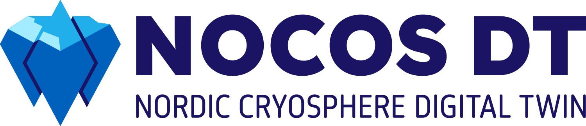

# NOCOS Digital Twin (NOCOS DT) Project

**NOCOS DT** aims to leverage ClimateDT data to deliver relevant information, analyses, and insights on sea ice conditions in the Nordic and Arctic regions.  
Through a set of practical use cases, the project demonstrates how integrated data and digital twin technologies can address real-world challenges related to sea ice, supporting users ranging from maritime operators to planners and researchers.

## Table of Contents
- [NOCOS DT project](#project-goal)
- [_ProjectLore_](#further-information)
- [NOCOS DT software](#nocos-dt-software-nocos_dt_soft)
- [Use cases](#use-cases)

## Project Goal

> **The primary goal of NOCOS DT is to use ClimateDT data to provide  _what do we provide? ... relevant data, analysis, and information_ regarding sea ice through a series of practical use case showcases.**

By integrating observational data, numerical models, and advanced analytics, NOCOS DT offers actionable solutions and decision support tailored for a variety of end-users operating in ice-affected waters.

---

## Project Structure

---
# NOCOS DT software 

## Installation instructions

## Common Tools

Reusable tools and modules for accessing, processing, and visualizing Climate DT sea ice data are developed and maintained in the [`common/`](common/README.md) directory.  
These shared utilities support various use cases across the NOCOS DT project.

For more details and usage instructions, see the [Common Tools README](common/README.md).

## Use Cases

NOCOS DT is organized around concrete Use Cases reflecting real-world challenges.  
Each Use Case delivers a dedicated set of tools, data, and documentation, with details available in the respective subfolders.

| Use Case Name                        | Description                                   | Link to README                                             |
|--------------------------------------|-----------------------------------------------|-----------------------------------------------------------|
| Marine Spatial Planning              | Decision support for planning in ice-affected waters | [README](usecases/MarineSpatialPlanning/)                 |
| Arctic Shipping                      | Risk Index Outcome: ship routing & risk assessment | [README](usecases/RIO/)                                   |
| Icebreaking_HiDEM                    | High-resolution icebreaking modeling          | [README](usecases/icebreaking_HiDEM/README.md)            |
| Landfast ice                         | Landfast ice occurrence in coastal areas      | [README](usecases/landfastice/)                |
| Marginal ice zone                    | Marginal Ice Zone detection and dynamics      | [README](usecases/marginal-ice-zone/README.md)            |
| Ridging                              | Modeling and analysis of sea ice ridging      | [README](usecases/ridging/)                               |
| Iceberg drift                        | Create input data for iceberg drift model     | [README](usecases/icebergdrift/)                          |

> **Each Use Case includes methods, codes, and documentation tailored for its specific application.  
> For more details, visit the target README in each use case directory.**

---

## Further Information

- [NOCOS DT website](https://wiki.eduuni.fi/x/_p2hH)

---

## Partners and Funding

NOCOS DT was funded by the [Nordic Council of Ministers](https://www.norden.org/en/nordic-council-ministers). The consortium consisted of [CSC – IT Center for Science](https://csc.fi/en/) (CSC), [Danish Meteorological Institute](https://www.dmi.dk/) (DMI), [Finnish Meteorological Institute](https://en.ilmatieteenlaitos.fi/) (FMI), [Norwegian Meteorological Institute](https://www.met.no/en) (MetNo), [Swedish Meteorological and Hydrological Institute](https://www.smhi.se/en/) (SMHI), and [Tallinn University of Technology](https://taltech.ee/en/) (TalTech).

