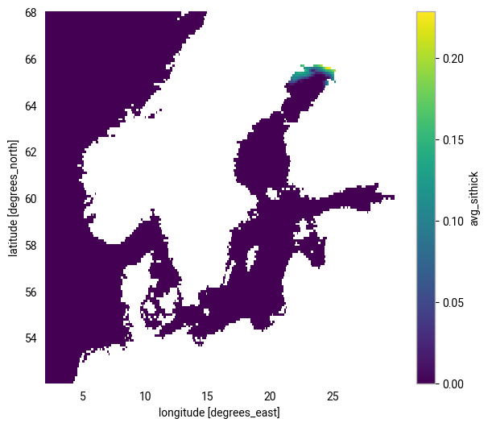

# Use Case: Marine Spatial Planning

## Description

<!-- Place holder for general description of the use case -->
[Add a brief summary of what this use case addresses and why it is important.]
## Marine Spatial Planning (MSP)

In the Baltic Sea, the impact of climate change on marine ecosystems—including changes in sea ice—is greater than all other anthropogenic impacts combined (Wåhlström et al., 2022).  
Gathering and presenting valuable information about sea ice changes due to climate change is therefore essential for MSP (Marine Spatial Planning) developers.

This use case provides an efficient Python framework for aggregating, processing, and visualizing Climate DT data, enabling informed MSP decision-making as new data becomes available.

### References
- ➤ Wåhlström et al. Projected climate change impact on a coastal sea—As significant as all current pressures combined. Global change biology, 28(17), 2022

## Overview Image

## Technical Description

<!-- Place holder for technical description -->
This case provides a first step towards using the Climate DT data for Marine Spatial Planning. A more advanced tool for data handling not yet linked to the Climate DT is available upon request on [SMHI GitLab](https://git.smhi.se/fou-oce-public/doris).

## Software Description

<!-- List and link the main scripts, notebooks, and tools used in this use case -->
- [ExploreDataLake.ipynb](ExploreDataLake.ipynb) – Access the data and plot several physical ocean variables
- [ExploreIceThicknessData.ipynb](ExploreIceThicknessData.ipynb) – Explore more specifically the ice thickness data available

---

## Footer

Back to [NOCOS github front page](../../README.md).  
For more information about NOCOS project, see the [NOCOS webpage](https://wiki.eduuni.fi/spaces/CSCNOCOS/pages/480353786/Nordic+Cryosphere+Digital+Twin).