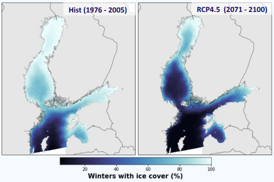
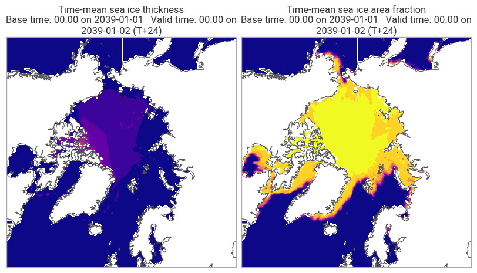

# Use Case: Marine Spatial Planning

## Description

<!-- Place holder for general description of the use case -->
[Add a brief summary of what this use case addresses and why it is important.]
## Marginal Ice Zone (MIZ)

In the Baltic Sea, the impact of climate change on marine ecosystems—including changes in sea ice—is greater than all other anthropogenic impacts combined (Wåhlström et al., 2022).  
Gathering and presenting valuable information about sea ice changes due to climate change is therefore essential for MSP (Marine Spatial Planning) developers.

This use case provides an efficient Python framework for aggregating, processing, and visualizing Climate DT data, enabling informed MSP decision-making as new data becomes available.

### Refferences
- ➤ Wåhlström et al. Projected climate change impact on a coastal sea—As significant as all current pressures combined. Global change biology, 28(17), 2022

## Overview Image

<!-- Link to image illustrating the use case (optional) -->
 <!-- Replace with actual image path or link -->

## Technical Description

<!-- Place holder for technical description -->
[Describe the scientific, computational, or methodological background relevant for this use case.  
Include information about the data used, processing steps, and any unique aspects.]

## Software Description

<!-- List and link the main scripts, notebooks, and tools used in this use case -->
- [script1.py](script1.py) – [Short description]
- [notebook_demo.ipynb](notebook_demo.ipynb) – [Short description]
- [other_tool.py](other_tool.py) – [Short description]

<!-- Add or remove items as needed -->
## Demo
[ eg... steps to create this]
 <!-- Replace with actual image path or link -->

---

## Footer

Back to [NOCOS github front page](../../README.md).  
For more information about NOCOS project, see the [NOCOS webpage](https://wiki.eduuni.fi/spaces/CSCNOCOS/pages/480353786/Nordic+Cryosphere+Digital+Twin).