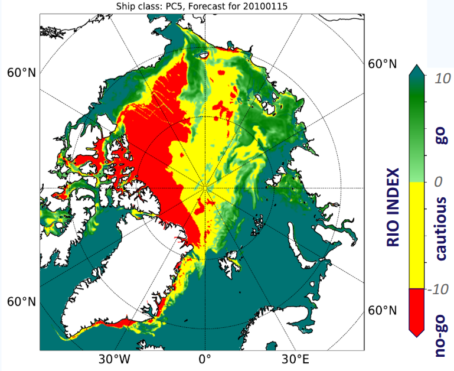

# Use case: Risk Index Outcome

## Description

RIO provides risk assessment and operational support for Arctic shipping based on ice concentration, ice thickness, and ship polar class.

**Advanced RIO calculation methods** can incorporate sea ice salinity or ice age data for thick ice, enabling precise determination of the POLARIS ice type.

**Usage:**
- Voyage planning
- Real-time decision making

## Overview

## Models and data

Copernicus, ECMWF and DMI HYCOM-CICE sea ice forecasting products have been used to develop the navigation risk indicator. The calculation method is implemented within the Destination Earth Climate Change Adaptation Digital Twin environment where the input data is streamed from the global high resolution Climate digital twin. Model outputs are validated by RIO in ice charts. In addition, an ice / no ice climatology and trend is derived.

## Key innovations

The Risk Index Outcome is a new parameter in modeling, decided jointly by ice condition and ship class. Traditionally, the ice condition includes sea ice concentration and thickness. Salinity and age are introduced in the innovative RIO calculation algorithm developed by NOCOS DT as novel parameters, to better determine the POLARIS ice type, providing a more accurate RIO outcome.

## Software description

- [script1.py](script1.py)
- [notebook_demo.ipynb](notebook_demo.ipynb)
- [other_tool.py](other_tool.py)

---

Back to the [NOCOS DT GitHub front page](../../README.md).  

For more information about the NOCOS DT project, see the [NOCOS DT website](https://wiki.eduuni.fi/x/_p2hH).
