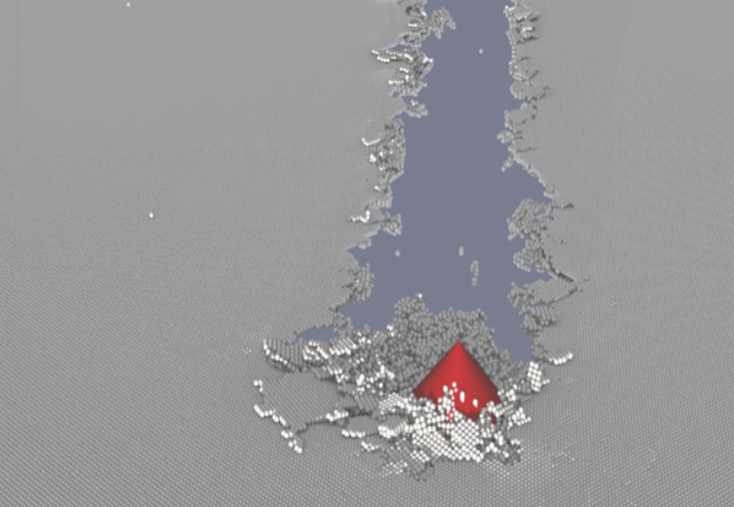

# Use Case: High resolution sea ice model

## Description

<!-- Place holder for general description of the use case -->
[Add a brief summary of what this use case addresses and why it is important.]

_Traditionally, sea ice dynamics have been modeled using continuum-based methods such as finite-element or finite-difference schemes. The NOCOS-DT project introduces a high-resolution Discrete Element Model (DEM) approach to better capture sea ice behavior at sub-kilometer scales, where continuum models become unreliable due to the multifractal nature of ice dynamics—evidenced by ship-radar observations. To address the computational intensity of DEM, we developed the HiDEM code, a GPU-optimized simulation tool written in CUDA and HIP, capable of modeling sea ice at 0.5-meter spatial and millisecond temporal resolution across large areas. Initially designed for studying brittle fragmentation and glacier calving, HiDEM now enables realistic simulations of sea ice interactions with infrastructure such as wind power pylons._

## Overview Image

<!-- Link to image illustrating the use case (optional) -->
 <!-- Replace with actual image path or link -->

## Technical Description

<!-- Place holder for technical description -->
[Describe the scientific, computational, or methodological background relevant for this use case.  
Include information about the data used, processing steps, and any unique aspects.  e.g  How to get the picture above... ]

## Software Description

<!-- List and link the main scripts, notebooks, and tools used in this use case -->
- [script1.py](script1.py) – [Short description]
- [notebook_demo.ipynb](notebook_demo.ipynb) – [Short description]
- [other_tool.py](other_tool.py) – [Short description]

<!-- Add or remove items as needed -->

---

## Footer

Back to [NOCOS github front page](../../README.md).  
For more information about NOCOS project, see the [NOCOS webpage](https://wiki.eduuni.fi/spaces/CSCNOCOS/pages/480353786/Nordic+Cryosphere+Digital+Twin).