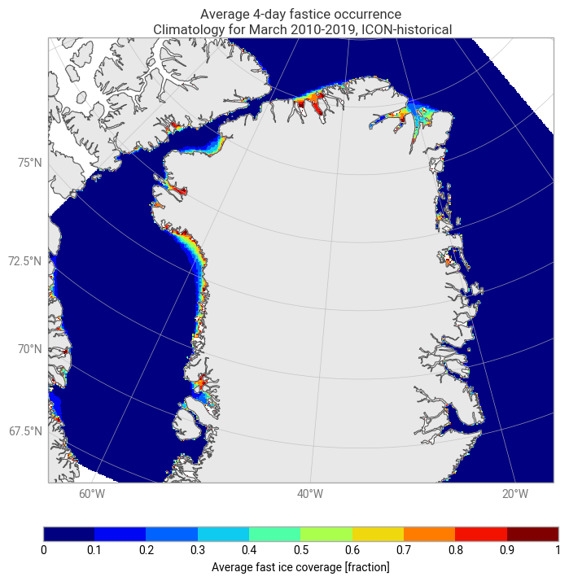
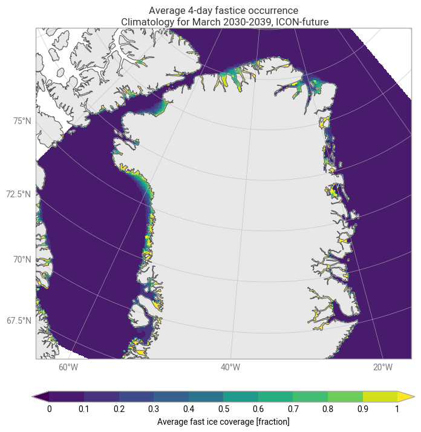

# Use Case: Landfast Ice Occurances

## Description

<!-- Place holder for general description of the use case -->
[Add a brief summary of what this use case addresses and why it is important.]
Landfast ice refers to sea ice that remains stationary even under wind and ocean forcing, due to anchor points that lock the ice in place.  
Simulating realistic landfast ice is challenging, but understanding its occurrence is crucial:

- Local communities e.g. in Greenland rely on landfast ice areas for their traditional hunting and fishing activities, which still from the basis for many people's means of living.
- Additionally, landfast ice is used by locals in many Arctic regions for travelling, both by means of dog sledges and by constructing ice roads.
- A reduction in landfast ice is expected with climate change, affecting both travel possibilities and local economies.

The Climate Adaptation Digital Twin simulations (ClimateDT) offer a great opportunity to assess the expected changes in landfast ice coverage because these simulations feature high spatial resolution which is necessary to adequately resolve the coastal areas. 

## Overview Image

<!-- Link to image illustrating the use case (optional) -->
 
 

## Technical Description

<!-- Place holder for technical description -->
[Describe the scientific, computational, or methodological background relevant for this use case.  
Include information about the data used, processing steps, and any unique aspects.]

This usecase provides a tool to derive landfast ice covered areas from ClimateDT simulations. 
We define a gridcell in a ClimateDT simulation to be covered by landfast ice if:  
    a) The daily mean ice drift speed is below a threshold (default 5e-4 m/s). 
    b) The daily mean sea ice concentration is above 90 %.
    c) The conditions a) and b) are met for several days in a row (defaut 4 days) 

Problems:
daily mean speed

## Software Description

### Description of files

<!-- List and link the main scripts, notebooks, and tools used in this use case -->
- [landfastice_climatolgoy.py](landfastice_climatology.py) – The main script: Retrieves data from ClimateDT, derives monthly landfast ice climatologies, and saves the results as plots.
- [utils/](utils/) – Utility functions used in the script
- [utils/download_icedata_c.py](utils/download_icedata_c.py) – Symbolic link to the common function that downloads ice data from ClimateDT through Polytope
- [utils/fastice.py](utils/fastice.py) – Function calculating areas covered by landfast ice
<!-- - [utils/domains???.py](utils/domains???.py) – Set up of plotting domains -->
- [plot_external_fasticedata.py](plot_external_fasticedata.py) – Script for plotting other landfastice datasets (e.g. used for comparison)

### Python requirements

The code provided in this usecase does not require any additional Python packages. It is sufficient to install the packages listed in Polytope's [environment.yml](https://github.com/destination-earth-digital-twins/polytope-examples/blob/868ddbde5139a448ac94e937cd12ec8fe258219b/environment.yml) file.

---

## Footer

Back to [NOCOS github front page](../../README.md).  
For more information about NOCOS project, see the [NOCOS webpage](https://wiki.eduuni.fi/spaces/CSCNOCOS/pages/480353786/Nordic+Cryosphere+Digital+Twin).
