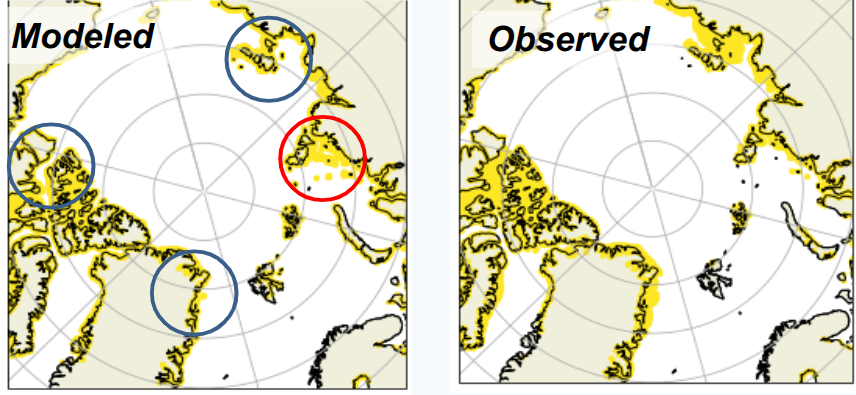

# Use Case: Landfast Ice Occurances

## Description

Here we change the LFI REadme.

<!-- Place holder for general description of the use case -->
[Add a brief summary of what this use case addresses and why it is important.]
Landfast sea ice (LFSI) refers to ice that remains stationary even under wind and ocean forcing, due to anchor points that lock the ice in place.  
Simulating realistic LFSI is challenging, but understanding its occurrence is crucial:

- Landfast ice enables over-ice travel and the construction of ice roads.
- It is important for fisheries, as local communities rely on it for fishing.
- A reduction in LFSI is expected with climate change, affecting both travel and local economies.

## Overview Image

<!-- Link to image illustrating the use case (optional) -->
 <!-- Replace with actual image path or link -->

## Technical Description

<!-- Place holder for technical description -->
[Describe the scientific, computational, or methodological background relevant for this use case.  
Include information about the data used, processing steps, and any unique aspects.]

## Software Description

<!-- List and link the main scripts, notebooks, and tools used in this use case -->
- [script1.py](script1.py) – [Short description]
- [notebook_demo.ipynb](notebook_demo.ipynb) – [Short description]
- [other_tool.py](other_tool.py) – [Short description]

<!-- Add or remove items as needed -->

---

## Footer

Back to [NOCOS github front page](../../README.md).  
For more information about NOCOS project, see the [NOCOS webpage](https://wiki.eduuni.fi/spaces/CSCNOCOS/pages/480353786/Nordic+Cryosphere+Digital+Twin).