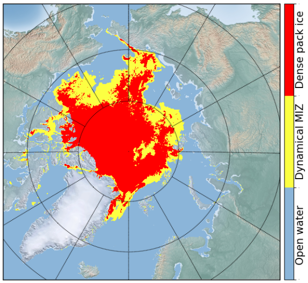

# Use case: Marginal ice zone

## Description

The Marginal Ice Zone (MIZ) is a transition region between open water and dense pack ice, shaped by dynamic interactions among the atmosphere, ocean, sea ice, and waves.  
MIZ is typically more navigable than the inner pack ice, making it important for maritime operations.

- Traditionally, MIZ is defined as areas with sea ice concentration between 0.1 and 0.8.
- Advanced approaches also parameterize the MIZ using both sea ice concentration and thickness (see Wang et al., 2024).

Understanding and identifying the MIZ supports navigation and research on ocean-ice interactions.

### References
- ➤   Wang et al. Local analytical optimal nudging for assimilating AMSR2 sea ice concentration in a high-resolution pan-Arctic coupled ocean (HYCOM 2.2.98) and sea ice (CICE 5.1.2) model, The Cryosphere, 2023 
- ➤   Wang et al. Multisensor data fusion of operational sea ice observations, Frontiers in Marine Science, 2024

## Overview

## Models and data

- CMEMS operational reanalysis and forecast products including NEMO, TOPAZ5 and neXtSIM
- Norwegian high-resolution pan-Arctic coupled model NorHAPS
- Climate DT models IFS-NEMO, ICON
- Definition of criteria for the MIZ, and development of methods to derive MIZ properties from standard variables
- Calculation of spatial distribution of MIZ from existing data sources (e.g., Copernicus, Climate DT)

---

Back to the [NOCOS DT GitHub front page](../../README.md).  

For more information about the NOCOS DT project, see the [NOCOS DT website](https://wiki.eduuni.fi/x/_p2hH).
