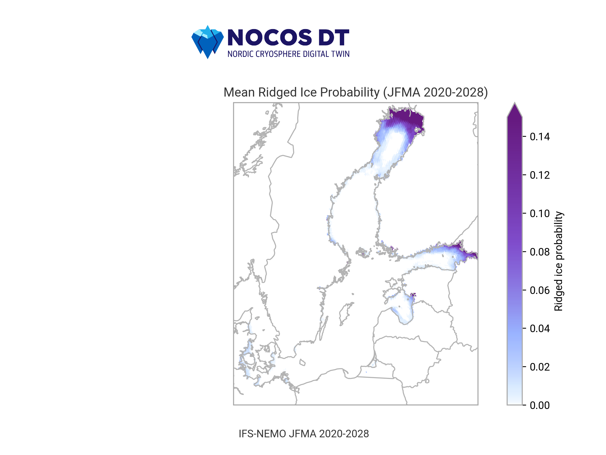

# Use Case: Sea ice ridging

## Description

Sea ice ridging can be hazardous for offshore and coastal construction and significantly limits the servicing and maintenance of offshore facilities. It is important to consider ridged ice–related risks during the design of constructions to assure optimal maintenance and servicing costs for each facility.

Ridged ice forms in areas of high ice dynamics, especially close to the coastal zone—often coinciding with regions of high interest for coastal developers such as wind farms, aquafarms, and Floating Storage Regasification Units (FSRU). Understanding the probability and characteristics of ridged ice occurrence is also essential for safe winter navigation and icebreaking operations.

Knowledge of expected changes in ridged ice will have considerable social and economic impacts by:

- Increasing the safety of wintertime navigation.
- Preventing ice-related hazards for coastal and offshore structures.
- Informing robust engineering design and risk management for new offshore developments.

## Overview

## Technical description

- Ridged ice is quantified from Climate DT

- Ridged ice is quantified from local Digital Twin (DT) results by:
  - Implementing a Lagrangian Particle Model.
  - Interpreting high-resolution sea ice state and sea ice drift data.

---

Back to the [NOCOS DT GitHub front page](../../README.md).  

For more information about the NOCOS DT project, see the [NOCOS DT website](https://wiki.eduuni.fi/x/_p2hH).
